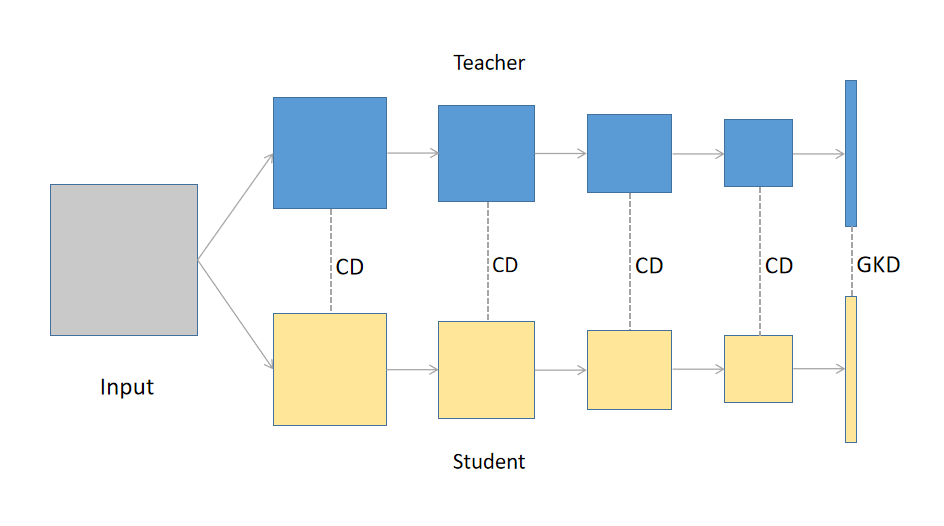

# Channel Distillation

PyTorch implement of [Channel Distillation: Channel-Wise Attention for Knowledge Distillation](https://arxiv.org/abs/2006.01683)



## Novelty

1. Channel Distillation (CD)
2. Guided Knowledge Distillation (GKD)
3. Early Decay Teacher (EDT)

**Note**
> In our code, kdv2 means GKD and lrd2 means EDT.

## Requirements

> python >= 3.7  
> torch >= 1.4.0
> torvision >= 0.5.0

## Experiments

### ImageNet

#### Prepare Dataset

+ Download the ImageNet dataset from http://www.image-net.org/
+ Then, and move validation images to labeled subfolders, using [the following shell script](https://raw.githubusercontent.com/soumith/imagenetloader.torch/master/valprep.sh)
+ Path of data need be set in `imagenet_config.py`

```bash
images are arranged in this way

./data/train/dog/xxx.png
./data/train/cat/xxy.png
./data/val/dog/xxx.png
./data/val/cat/xxy.png
```

#### Training

Running the following command and experiment will be launched.

```bash
CUDA_VISIBLE_DEVICES=0 python3 ./imagenet_train.py
```

If you want to run other experiments, you just need modify following losses in `imagenet_config.py`

+ s_resnet18.t_resnet34.cd.ce
```python
loss_list = [
    {"loss_name": "CELoss", "loss_rate": 1, "factor": 1, "loss_type": "ce_family", "loss_rate_decay": "lrdv1"},
    {"loss_name": "CDLoss", "loss_rate": 6, "factor": 1, "loss_type": "fd_family", "loss_rate_decay": "lrdv1"},
]
```

+ s_resnet18.t_resnet34.cd.ce.kdv2
```python
loss_list = [
    {"loss_name": "CELoss", "loss_rate": 1, "factor": 1, "loss_type": "ce_family", "loss_rate_decay": "lrdv1"},
    {"loss_name": "KDLossv2", "T": 1, "loss_rate": 1, "factor": 1, "loss_type": "kdv2_family", "loss_rate_decay": "lrdv1"},
    {"loss_name": "CDLoss", "loss_rate": 6, "factor": 0.9, "loss_type": "fd_family", "loss_rate_decay": "lrdv1"},
]
```

+ s_resnet18.t_resnet34.cd.kdv2.lrdv2
```python
loss_list = [
    {"loss_name": "CELoss", "loss_rate": 1, "factor": 1, "loss_type": "ce_family", "loss_rate_decay": "lrdv2"},
    {"loss_name": "KDLossv2", "T": 1, "loss_rate": 1, "factor": 1, "loss_type": "kdv2_family", "loss_rate_decay": "lrdv2"},
    {"loss_name": "CDLoss", "loss_rate": 6, "factor": 0.9, "loss_type": "fd_family", "loss_rate_decay": "lrdv2"},
]
```

#### Result

+ Ablation Study

| Method | Model | Top-1 error(%) | Top-5 error(%) |
| -- | -- | -- | -- |
| teacher | ResNet34 | 26.73 | 8.74 |
| student | ResNet18 | 30.43 | 10.76 |
| KD | ResNet34-ResNet18 | 29.50 | 9.52 |
| **CD(our)** | ResNet34-ResNet18 | 28.53 | 9.56 |
| **CD+GKD(our)** | ResNet34-ResNet18 | 28.26 | 9.41 |
| **CD+GKD+EDT(our)** | ResNet34-ResNet18 | 27.61 | 9.2 |

+ Comparion result with other methods

| Method | Model | Top-1 error(%) | Top-5 error(%) |
| -- | -- | -- | -- |
| teacher | ResNet34 | 26.73 | 8.74 |
| student | ResNet18 | 30.43 | 10.76 |
| KD | ResNet34-ResNet18 | 29.50 | 9.52 |
| FitNets | ResNet34-ResNet18 | 29.34 | 10.77 |
| AT | ResNet34-ResNet18 | 29.30 | 10.00 |
| RKD | ResNet34-ResNet18 | 28.46 | 9.74 |
| **CD+GKD+EDT(our)** | ResNet34-ResNet18 | 27.61 | 9.2 |

### CIFAR100

#### Prepare Dataset
CIFAR100 dataset will be downloaded automatically.

#### Training

Running the following command and experiment will be launched.

```bash
CUDA_VISIBLE_DEVICES=0 python3 ./cifar_train.py
```

If you want to run other experiments, you just need modify following losses in `cifar_config.py`

+ s_resnet18.t_resnet34.cd.ce
```python
loss_list = [
    {"loss_name": "CELoss", "loss_rate": 1, "factor": 1, "loss_type": "ce_family", "loss_rate_decay": "lrdv1"},
    {"loss_name": "CDLoss", "loss_rate": 6, "factor": 1, "loss_type": "fd_family", "loss_rate_decay": "lrdv1"},
]
```

+ s_resnet18.t_resnet34.cd.ce.kdv2
```python
loss_list = [
    {"loss_name": "CELoss", "loss_rate": 1, "factor": 1, "loss_type": "ce_family", "loss_rate_decay": "lrdv1"},
    {"loss_name": "KDLossv2", "T": 1, "loss_rate": 0.1, "factor": 1, "loss_type": "kdv2_family", "loss_rate_decay": "lrdv1"},
    {"loss_name": "CDLoss", "loss_rate": 6, "factor": 0.9, "loss_type": "fd_family", "loss_rate_decay": "lrdv1"},
]
```

+ s_resnet18.t_resnet34.cd.kdv2.lrdv2
```python
loss_list = [
    {"loss_name": "CELoss", "loss_rate": 1, "factor": 1, "loss_type": "ce_family", "loss_rate_decay": "lrdv2"},
    {"loss_name": "KDLossv2", "T": 1, "loss_rate": 0.1, "factor": 1, "loss_type": "kdv2_family","loss_rate_decay": "lrdv2"},
    {"loss_name": "CDLoss", "loss_rate": 6, "factor": 0.9, "loss_type": "fd_family", "loss_rate_decay": "lrdv2"},
]
```

#### Result

+ Ablation Study

| Method | Model | Top-1 error(%) | Top-5 error(%) |
| -- | -- | -- | -- |
| teacher | ResNet152| 19.09 | 4.45 |
| student | ResNet50 | 22.02 | 5.74 |
| KD | ResNet152-ResNet50 | 20.36 | 4.94 |
| **CD(our)** | ResNet152-ResNet50 | 20.08 | 4.78 |
| **CD+GKD(our)** | ResNet152-ResNet50 | 19.49 | 4.85 |
| **CD+GKD+EDT(our)** | ResNet152-ResNet50 | 18.63 | 4.29 |
